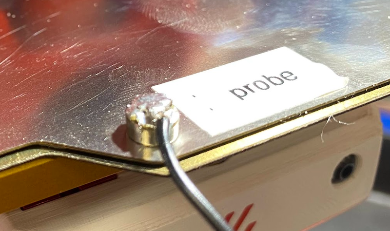
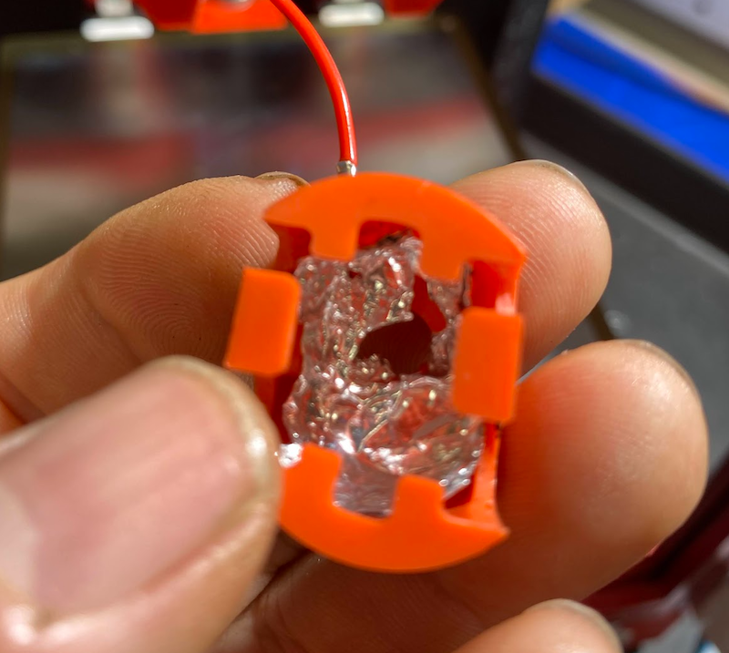
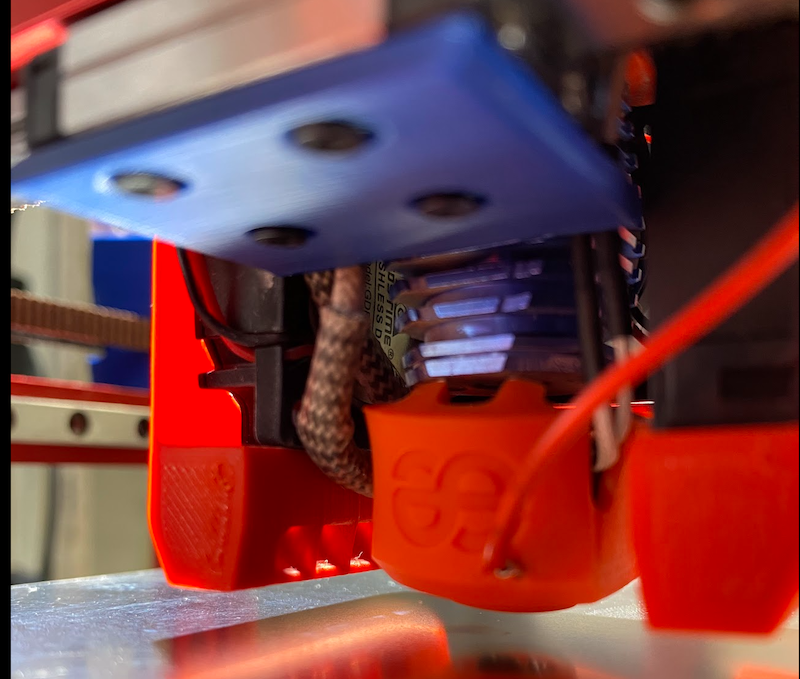

# Nozzy Probe : Plate Nozzle Probe for V0.1 (might work for others) ALPHA

*** I am not responsible for any damage to your printer ***

[]


## Bill of materials
- [ ] 1 x PEI Sheet with an bare side (must be conductive)
- [ ] 1 x Small Magnet
- [ ] 1 x JST 5 pin connector
- [ ] 2 x JST pins
- [ ] 1 x DuPont male pin
- [ ] 1 x aluminum foil
- [ ] 1 x hotend sock
- [ ] 2 x 24 AWG wire 50 cm (length various on wire path)
- [ ] 1 x Optional piece of sandpaper
- [ ] 1 x Optional Sticker/Label (to make which is the probe side for your plate)


## Tools
- [ ] Multimeter to test for continuity
- [ ] Caliper to measure plate thickeness
- [ ] Soldering Iron
- [ ] Crimper for JST/DuPont

## Installation Notes for SKR Mini E3 v2

- TURN OFF YOUR PRINTER

### Using Z-Probe port 
Crimp JST pins on th ends of both wires and insert into the JST 5 pin connector for PC14 and GND
### Pin out connections


Run one wire to the toolhead and the other to the bed, it doesn't matter which wire goes where.

#### Using Z-Endstop port (should be possible but I haven't tested)

### Solder the bed wire to the magnet, this will be used to stick to the PEI sheet on the bare side.
 

### Line the hotend sock with a small piece of alumunim foil. Fold the foil a few times.
   

Crimp the DuPont male pin to the hotend wire.
### Puncture the hotend sock with the male pin, and ensure it's touching the foil
   

### Add/Modify printer configuration (shameless stolen from Klicky)
```python
[probe]
pin: ^!PC14  # for SKR Mini E3 v2
x_offset: 0
y_offset: 0
z_offset: .7 # use calipher to measure plate thickness if you're stacking otherwise use 0 for single plate
speed: 7
lift_speed: 7

samples: 3
samples_result: median
sample_retract_dist: 2

samples_tolerance: 0.01
samples_tolerance_retries: 10
```


```python
[bed_mesh]
mesh_min: 15,15
mesh_max: 105,105
speed: 100
horizontal_move_z: 20 

probe_count: 3,3					 #if you would like more detail, use 5,5 here
relative_reference_index: 4			 #if you use 5,5 above, place 12 here
move_check_distance: 3

algorithm: lagrange
fade_start: 1
fade_end: 10
fade_target: 0
split_delta_z: 0.0125
mesh_pps: 2,2
```

## Usage
Use stacked plates, the offset plate on top of your printing plate.  This will allow you to probe multiple plates without have to adjust the ```z-offset```.  However, you can use one plate just make sure you have 0 as your offset.  Be sure to clean your plate, and your nozzle.  Use a small piece of sandpaper on the nozzle to remove any old plastic.

   

### Sanity Check
Use the multimeter to test continuity from the magnet to the plate.
LABEL the conductive side of the PEI sheet with ```PROBE```, to avoid accidentally using the wrong side.

Unplug the connector from the Z-Probe port.
Use the multimeter to test continuity from the magnet to the other end of the wire.
Use the multimeter to test continuity from the nozzle to the other end of the wire.

If all is good then plug the connector back into the Z-Probe port.

- TURN ON YOUR PRINTER

## First Probe Test 
Enter ```QUERY_PROBE``` and you should get 

```python
// probe: open
```
While holding the plate probe with your HAND to the nozzle enter ```QUERY_PROBE``` again and you should get back
```python
// probe: TRIGGERED
```

Move the toolhead to the middle and the bed to the bottom.
Enter ```PROBE_ACCURACY``
and you should get something like back like 

```python
10:21:24 
// PROBE_ACCURACY at X:60.000 Y:60.000 Z:60.000 (samples=10 retract=2.000 speed=7.0 lift_speed=7.0)
10:21:33 
// probe at 60.000,60.000 is z=0.423438
10:21:34 
// probe at 60.000,60.000 is z=0.451406
10:21:35 
// probe at 60.000,60.000 is z=0.452969
10:21:36 
// probe at 60.000,60.000 is z=0.452813
10:21:37 
// probe at 60.000,60.000 is z=0.452188
10:21:38 
// probe at 60.000,60.000 is z=0.452188
10:21:40 
// probe at 60.000,60.000 is z=0.452656
10:21:41 
// probe at 60.000,60.000 is z=0.454063
10:21:42 
// probe at 60.000,60.000 is z=0.452813
10:21:43 
// probe at 60.000,60.000 is z=0.453594
10:21:43 
// probe accuracy results: maximum 0.454063, minimum 0.423438, range 0.030625, average 0.449813, median 0.452734, standard deviation 0.008820
```