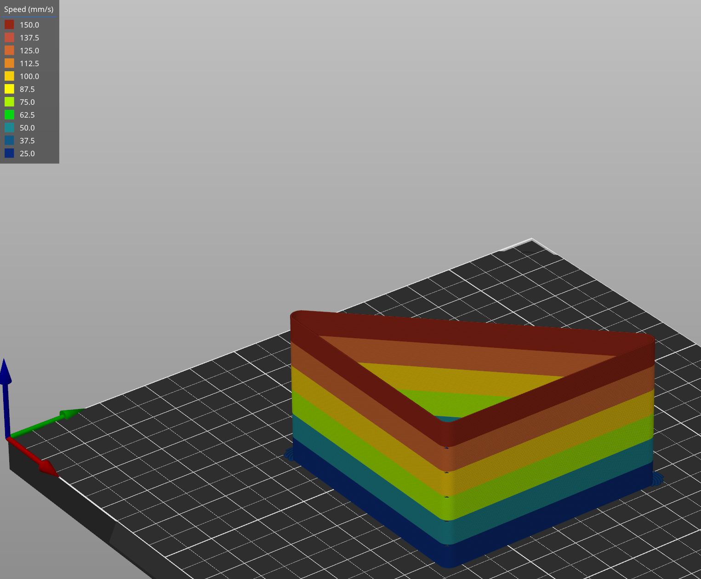
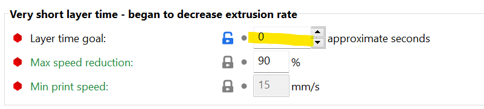

# VFA Print Tests for Superslicer

Be sure to set the Layer Time Goal un Filament/Cooling to 0 otherwise the speed changes may not occur.

- VFATest_Setup - Original Model, takes ~7 mins

- VFA_Model_SS - 247Printing model redesigned for printability, takes ~17 mins
- VFA_Model_SS_Thick - 247Printing model redesigned for printability, takes ~30 mins

   
   

