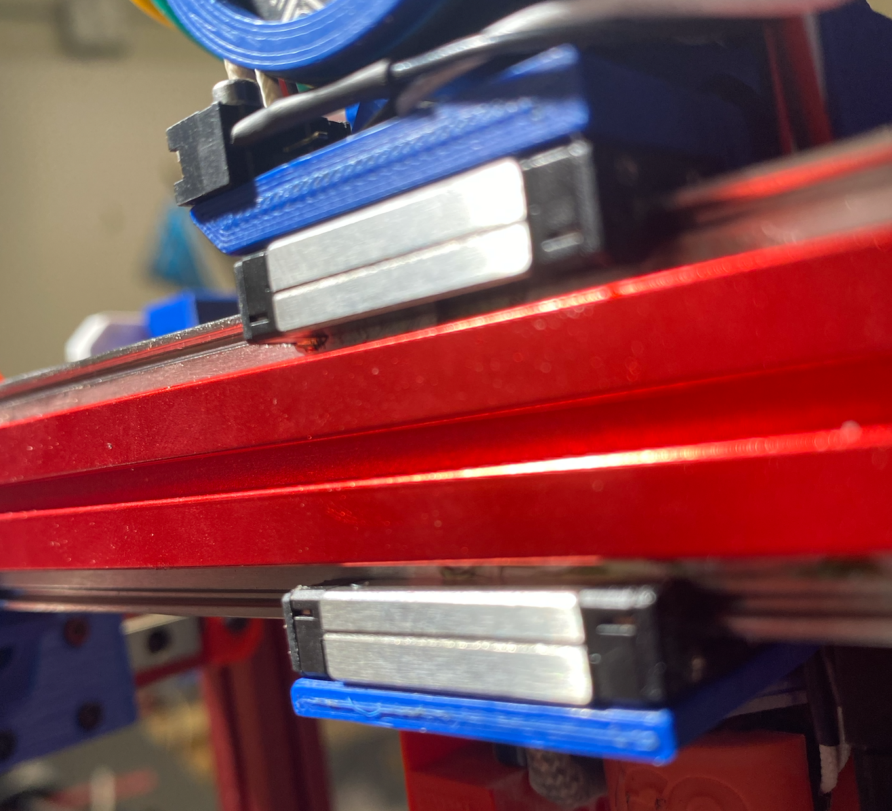

# Dual X Rail Carriage to V0.1

Add second rail to X-Axis to eliminate wobble

Requires:
1 x MGN7 rail (preferrable identical rail models)
4 x Machine Screw, FHCS, M2x6 (to attach carriage)
5 x M2x6 BHCS (mount rail to extrusion)
5 x M2 Nuts (mount rail to extrusion) or LDO rail mount

