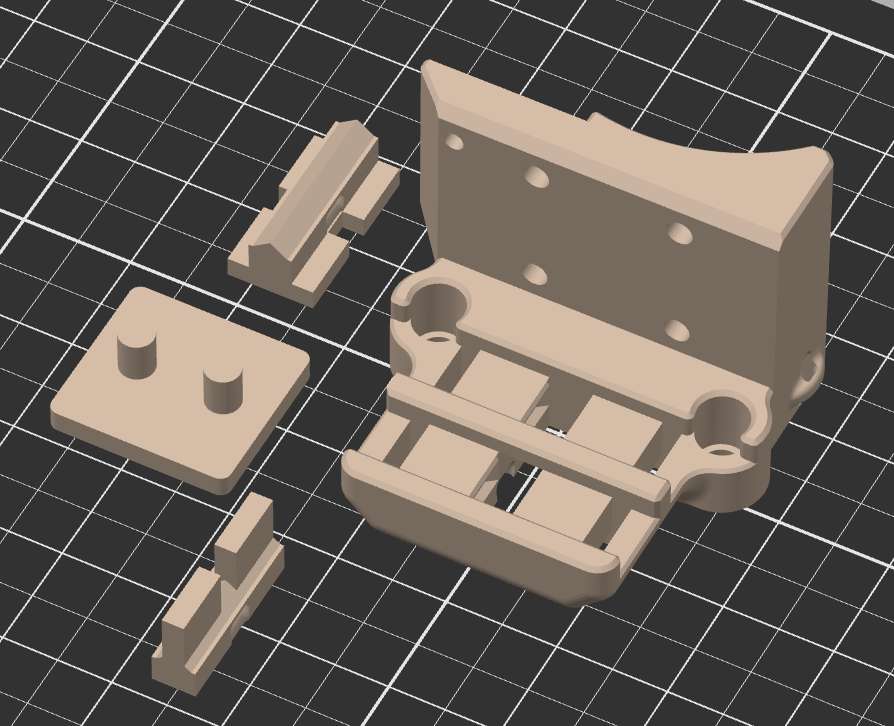
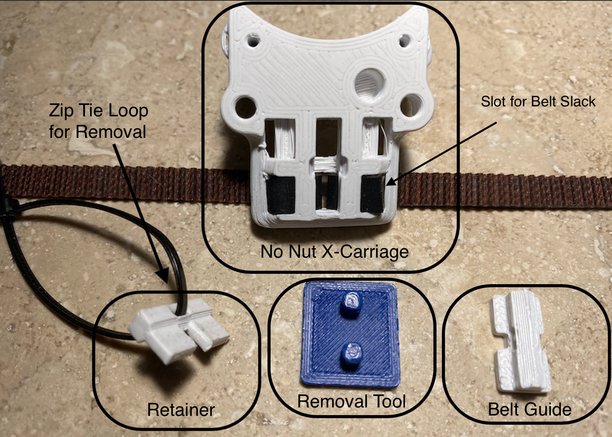
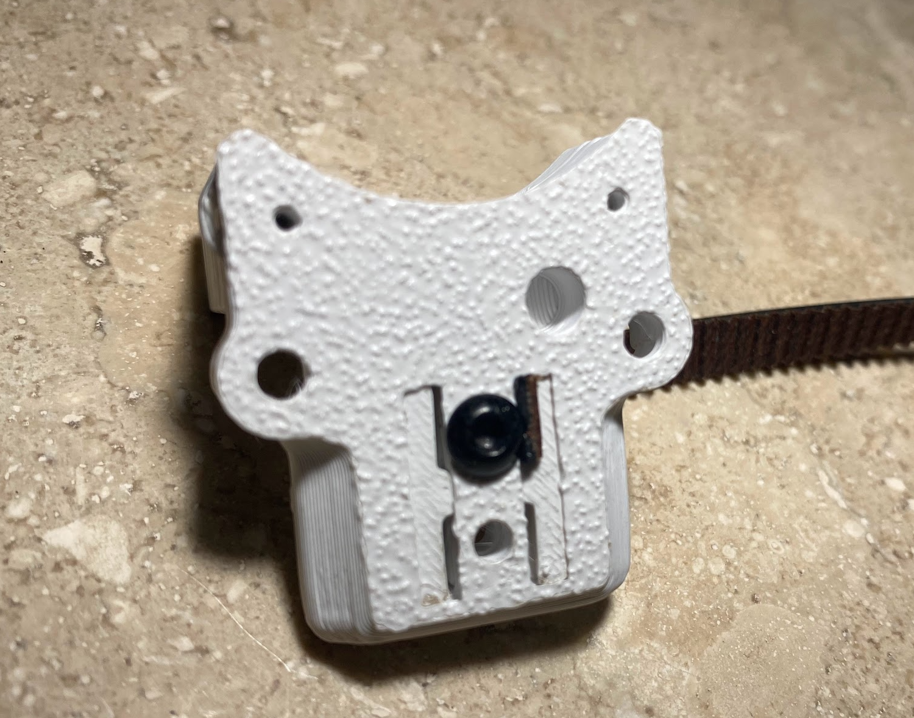

#No Nuts X-Carriage (beta) for V0.1 

"Easier" x-carriage without the need for the M3 “MakerBeam XL” Nuts

The alternate part *crossrail_slot* is the same mount but with slots to allow 10mm adjustment in either direction

## Bill of materials
 - 2 x M3x8 BHCS (same as original)
 - 2 x M3 Nuts (square is preferable)
 - 3 x Heat Set Inserts (same as original)
 - 1 x nonut_x_carriage_x1.stl
 - 1 x nonut_x_carriage_retainer_x1.stl
 - 1 x nonut_x_carriage_removal_tool_x1.stl

## Print Settings

 Print using Voron print specifications

Print Settings
These are the recommended settings.

Layer height: 0.2mm
Extrusion width: 0.4mm, forced
Infill pecentage: 40%
Infill type: grid, gyroid, honeycomb, triangle, or cubic
Wall count: 4
Solid top/bottom layers: 5
Supports: NONE

## Installation Notes
Insert the retainer into the carriage multiple times before attaching the belt.  This is to ensure there is a good fit. Use the removal tool to push out the retainer from the front. 

With the retainer position in from the the X extrusion, slide the belts into the retainer matching the teeth, and press the x-carriage on to the retainer. 

You can leave a little extra belt, if you want and bend it to the side.

Semi-Optional - Fasten with M3x8 screws, do not over tighten without nut

Optional nut - superglue the nut onto the retainer.

## Images
### Printed Parts

### Example Install

### Optional Nut with Superglue

