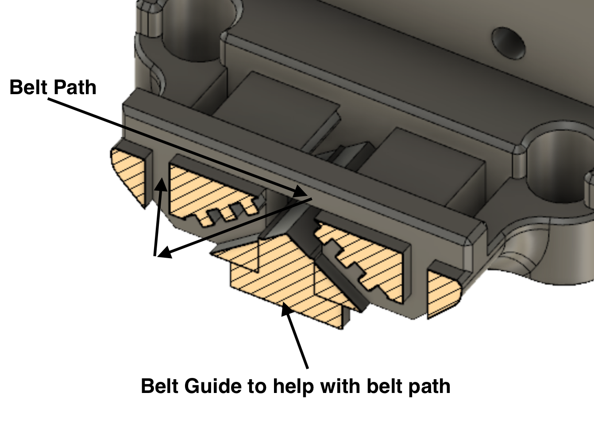

# No Nuts X-Carriage (beta) for V0.1 

"Easier" x-carriage without the need for the M3 “MakerBeam XL” Nuts

## Bill of materials
 - 3 x Heat Set Inserts (same as original)
 - 4 x M2 x 6 BHCS screws
 - 1 x nonut_x_carriage_x1.stl
 - 1 x nonut_x_carriage_retainer_x1.stl
 - 1 x nonut_x_carriage_removal_tool_x1.stl
 - 1 x nonut_x_carriage_belt_guide_x1.stl
 - 1 x optional sandpaper
## Print Settings

 Print using Voron print specifications

Print Settings
These are the recommended settings.

Layer height: 0.2mm
Extrusion width: 0.4mm, forced
Infill pecentage: 40%
Infill type: grid, gyroid, honeycomb, triangle, or cubic
Wall count: 4
Solid top/bottom layers: 5
Supports: NONE

## Installation Notes
Insert the retainer into the carriage multiple times before attaching the belt.  This is to ensure there is a good fit. Use the removal tool to push out the retainer from the back. You may need to sandpaper on the retainer if the fit is too tight.

Insert a ziptip into the retainer loop to verify that you can remove it.  If you cannot remove it fairly easily use some sandpaper to adjust the sides of the retainer a little bit.

Install heat inserts into the x-carriage.

Insert the belt guide from the front to help insert the belts into the slots from the back. (see Belt Path picture below)

Remove the belt guide and insert the retainer once you're happy with the belt length.

You can leave a little belt slack which will be bent into the slot to keep it from interfering with the toolhead.

Give the belts a good tug to double check they are secure.

Use the 4 M2x6 screws and mount into the rail carriage.

Cut the ziptie from the retainer.  If you need to remove the retainer in the future insert a ziptie and pull out the retainer.

## Images
### Printed Parts

### Belt Path 

Thanks @zruncho for the belt path idea. :D