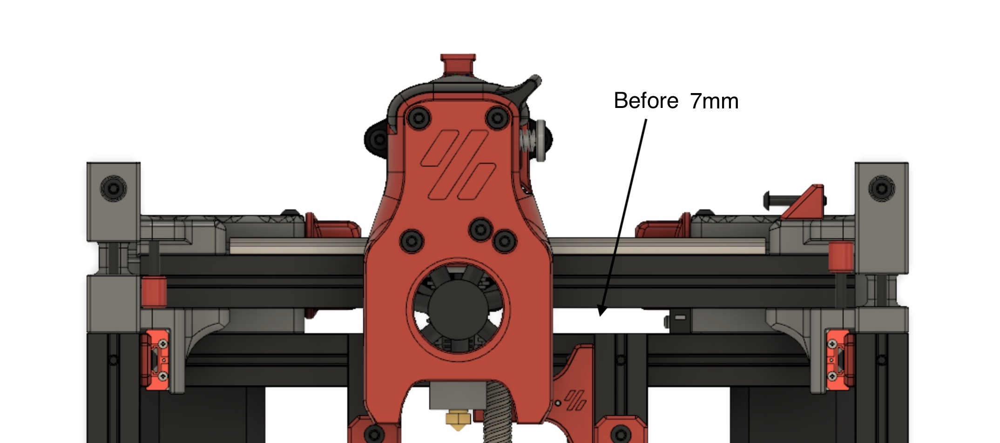
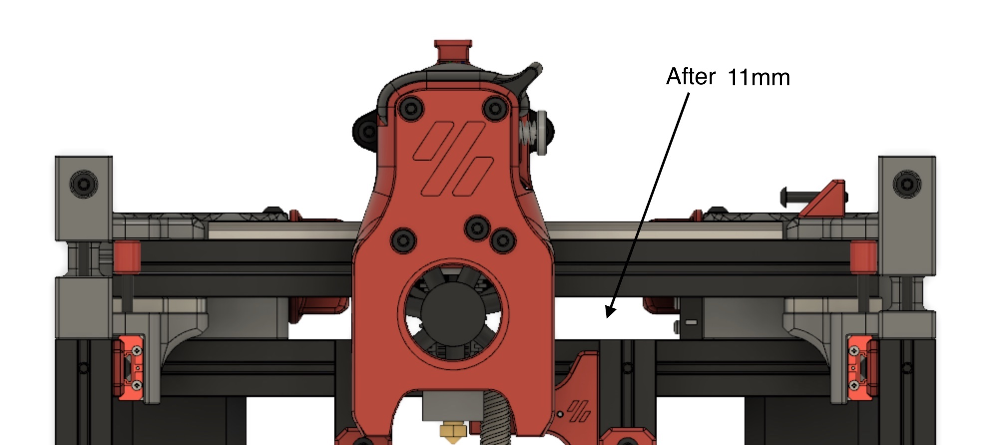

# Raise X-Axis Extrusion Clearance by 4mm

Adds 4mm clearance between X-Axis extrusion and Z-Axis extrusions.

Notes: Toolhead offset will change by 4 mm.  The toolhead must be lowered by 4mm to maintain Z toolhead offset or bed travel has to be raised by 4mm

