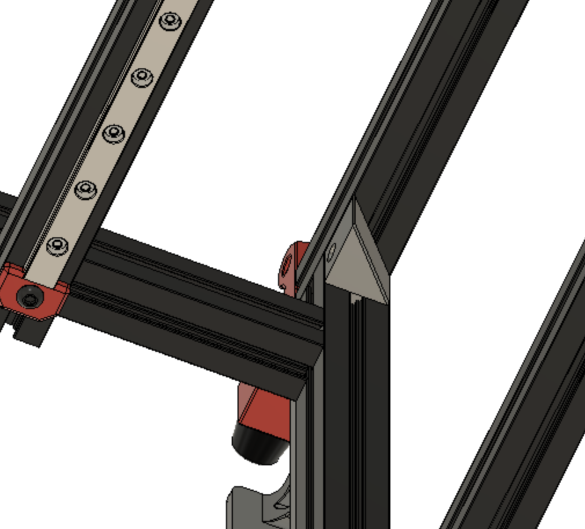

# Z Chain Mount V0.1 (Beta)

Easier way to attach and remove the z-chain for maintenance.

Use heat insert for screw
Press into extrusion rotate 90 degrees
Turn 90 degrees to lock into place and slide to the back panel

Check the number of chain links, since you may need to remove one or two.  I have 11 on mine with this mount.

   
   

