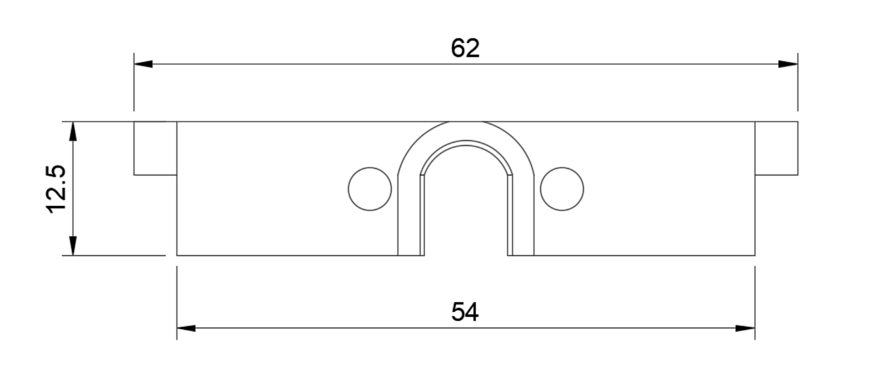
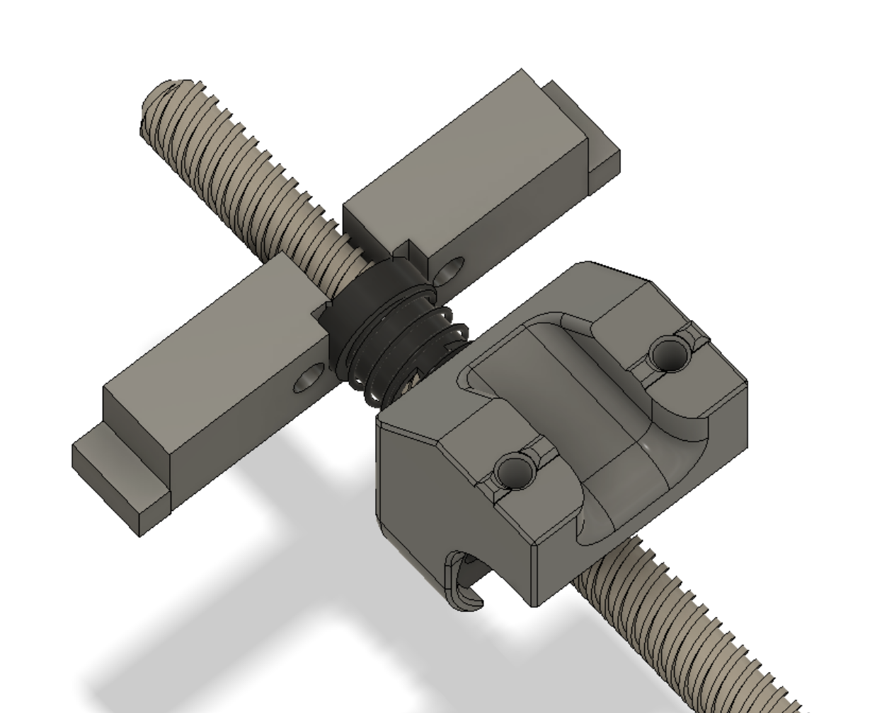
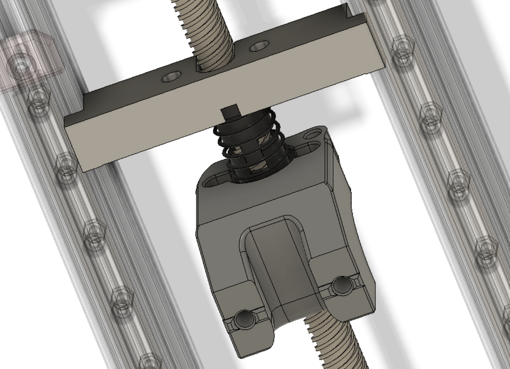

# Z-Leadscrew Alignment Tool V0.1 (Beta)

Help align the leadscrew and Anti-Backlash Nut 

It is recommend to print 2 of this tool to place at the top and the bottom along the leadscrew.

Use this tool with the printer turned off.

This is an alignment tool and should be removed before turn back on your printer.

Please verify the printed jig has the correct dimensions, it should be within .5mm of the diagram.
   

   
   

