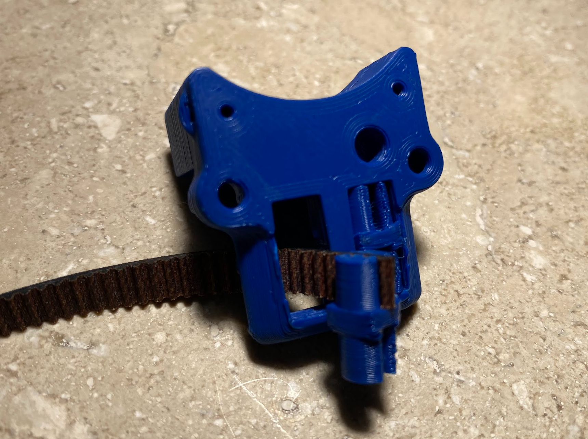

# X-Carriage press fit belt retainer (beta) for V0.1

x_carriage_pressfit_belt_x1.stl
x_carriage_pressfit_belt_retainer_x2

Print using Voron print specifications

Print Settings
These are the recommended settings.

Layer height: 0.2mm
Extrusion width: 0.4mm, forced
Infill pecentage: 40%
Infill type: grid, gyroid, honeycomb, triangle, or cubic
Wall count: 4
Solid top/bottom layers: 5
Supports: NONE

Use the same 3 heat inserts as the original.

Insert both retainers into the carriage multiple times before attaching the belt.  This is to ensure there is a good fit and the retainers can be removed.  You may need to use a blunt tool to push out the retainer. (Do NOT use a screwdriver or knife... you will hurt yourself)

(TODO: Make tool to push out the retainer)

If the retainer is too tight you can scale it to 99% or 98% in your slicer.

You can leave a little extra belt, if you want and bend it to the side.

Insert the belt from the back, slide the belt into the retainer match the teeth, and press the retainer into the x-carriage.

(TODO: Detailed instruction on how to tension the belts.  Press in one retainer with the belts, place the second retainer in front of the carriage and slide in the belts to measure but don't press in, loosen front idlers to give slack, move the second retainer 3/4 teeth back from where you measured, and press in second retainer.  Reinstall the front idlers)

