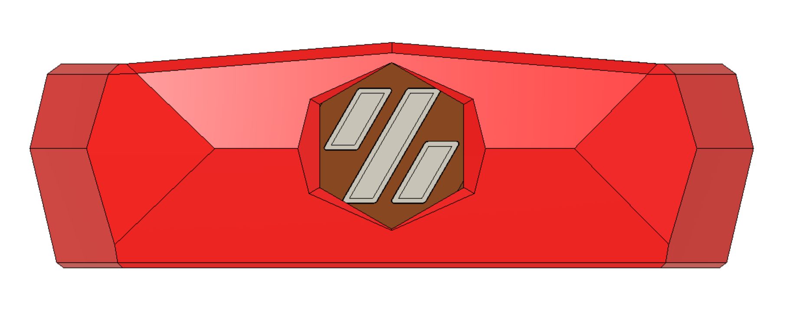
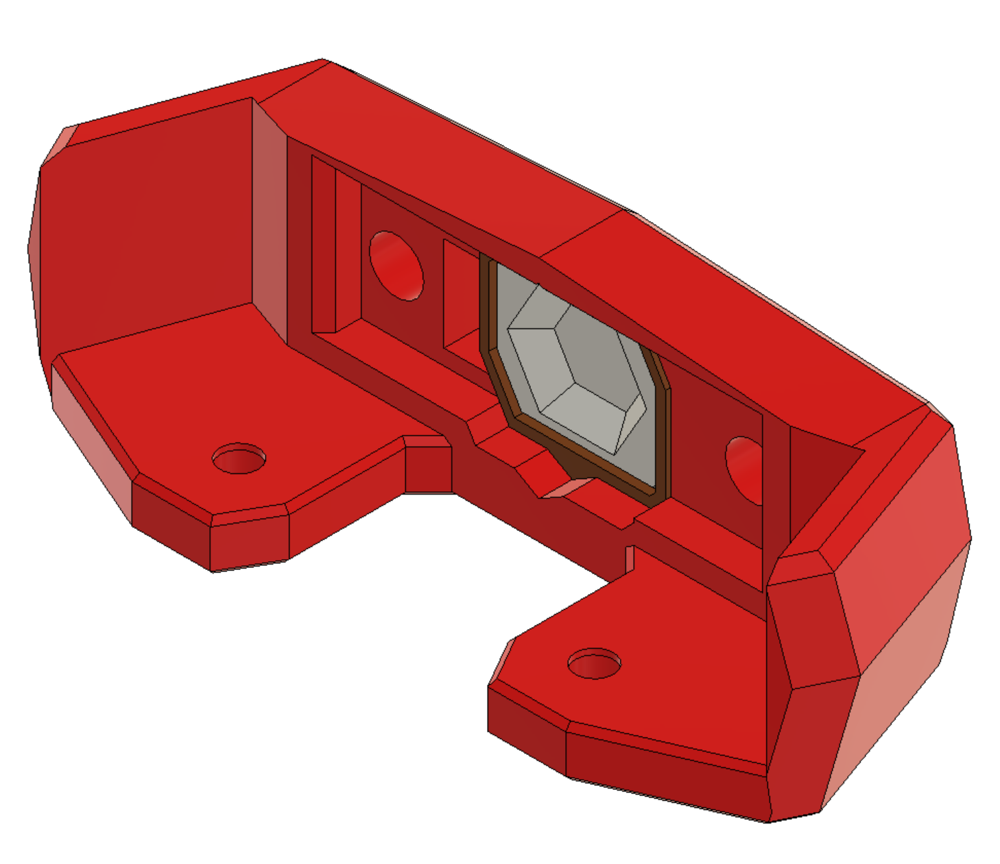

# Kirigami LDO Steath Bed Front V0.1

Based on MapleLeafMakers https://github.com/MapleLeafMakers/Stealth_Bed_Front

Used the Stealthburner toolhead diffuser https://github.com/VoronDesign/Voron-Stealthburner/blob/main/STLs/Stealthburner/%5Bc%5D_stealthburner_LED_diffuser.stl

Works only with the LDO Neopixel PCB

   
   

