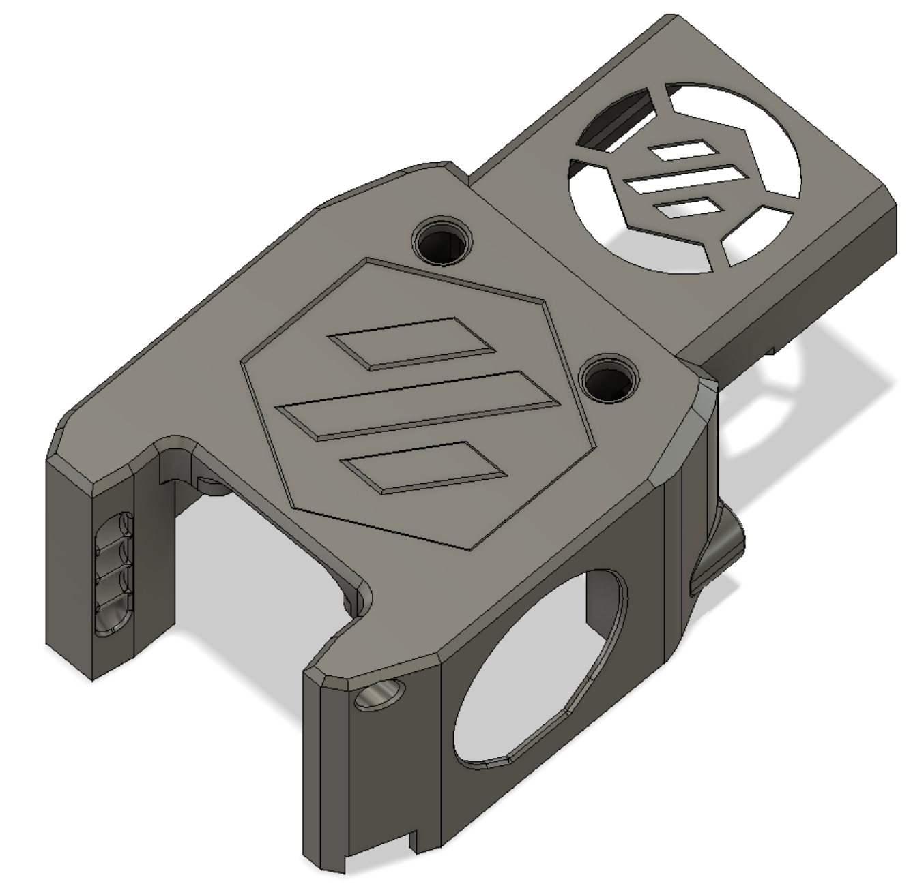
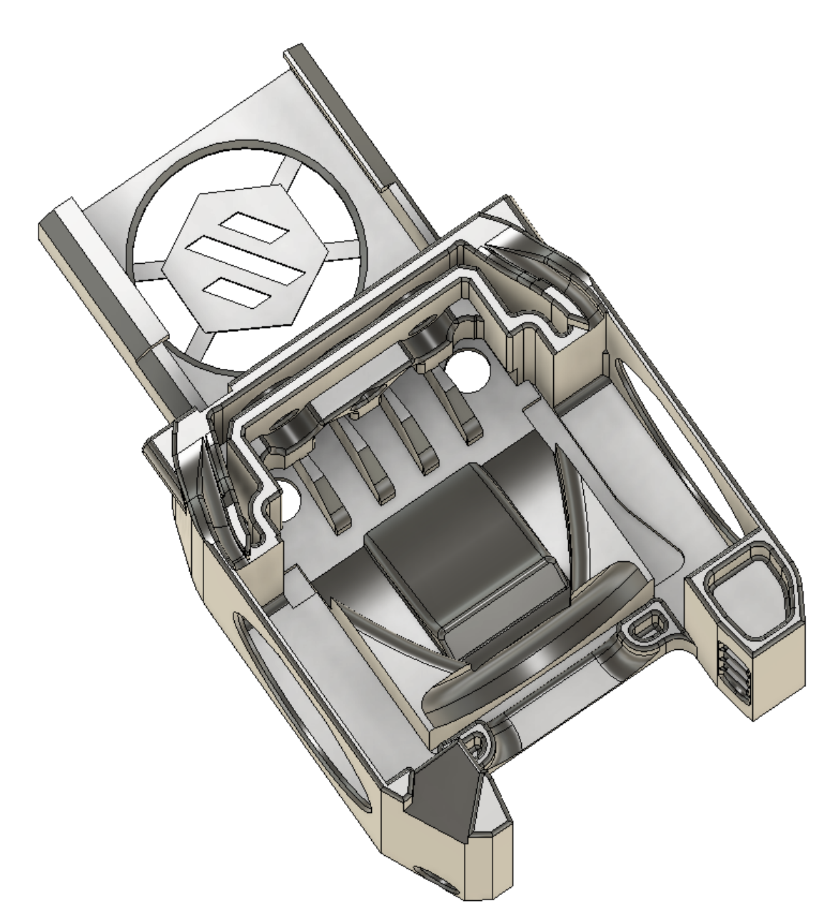

# MiniAfterBlockhead to V0.1 (Alpha)

Modified Mini After-LGX-Lite (Olof Ogland) to use 3010 Blower as Hotend Fan

## Why??
Better hotend cooling and reduces heat creep.

*** Extruders ***
- Direct Mounts
    - Sherpa Mini Extruder - With Modified Mid-Body (sherpa_mini_mid_flipped)
    - LGX Lite Extruder

*** Hotend Mount ***
- See Mini After-LGX-Lite Repo for your hotend mount (see below)

### X-Carriage or use the Mini After-LGX-Lite X-Carriage
V01_MiniAfterHybrid_XCarriage.stl  

## Bill of materials
2x M3×35mm FHCS, BHCS, or SHCS
2× M3×5×4mm heatset inserts
3× 3010 Blower fans (tested with GDSTime 24v)

### Sources
Source for Mini After-LGX-Lite: https://github.com/BondtechAB/VoronUsers/tree/master/printer_mods/Bondtech/Mini_After-LGX-Lite

Source for Klicky integration: https://github.com/jlas1/Klicky-Probe

Credits: 
Olof Ogland
Nemgrea
DaveR
JosAr
smolboi

