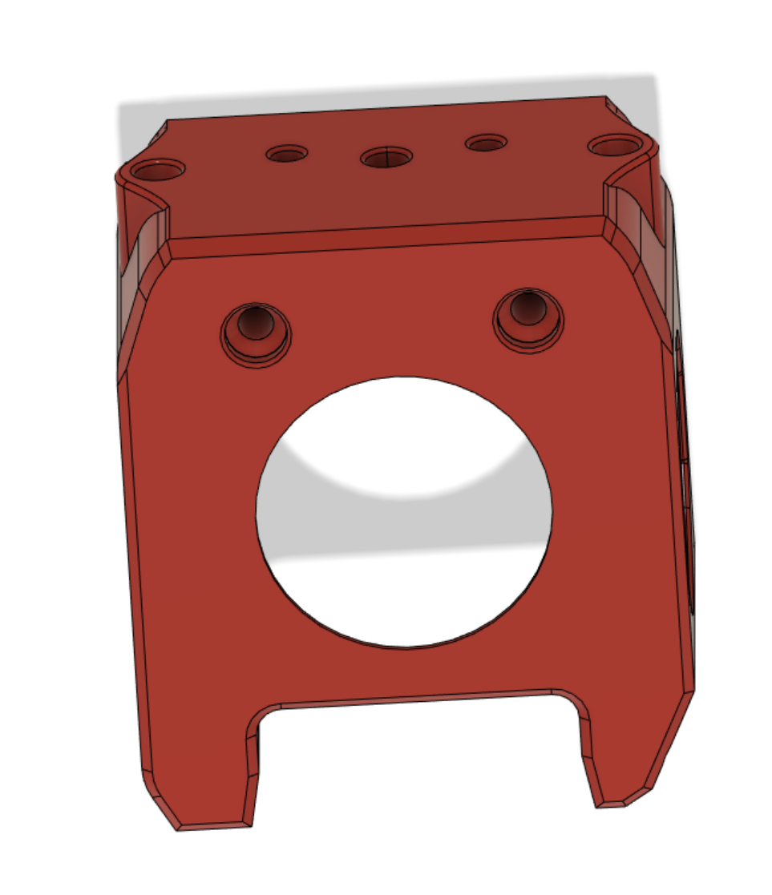
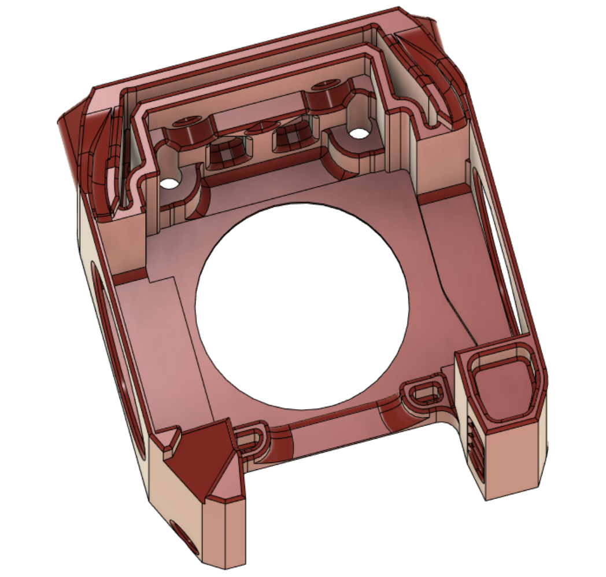

# MiniAfterHybrid to V0.1 (Beta)

Crossbreed Hybrid of the MiniAfterSherpa (Kyrios) &  Mini After-LGX-Lite (Olof Ogland)

## Why??
More flexiblity with one cowling - supports multiple extruders and multiple hotends

*** Extruders ***
- Direct Mounts
    - Sherpa Mini Extruder
    - LGX Lite Extruder with modified X-Carriage

- Needs Additional Adapter
    - LGX Lite + Adapter with standard X-Carriage
    - Orbiter 2  + Adapter with standard X-Carriage (coming soon)

*** Hotends ***
 - All the hotends that Mini After-LGX-Lite support
 - Revo Micro (Alpha) (requires reprint of the cowling and mount)

## Bill of materials
2x M3×35mm FHCS, BHCS, or SHCS
2× M3×5×4mm heatset inserts
2× 3010 Blower fans
1× 3007 Axial fan

3x M2.5x10mm Dragonfly mount (comes with hotend)

### Optional
V01_MiniAfterHybrid_XCarriage.stl  

### Sources
Source for MiniAfterSherpa https://github.com/KurioHonoo/Mini-AfterSherpa

Source for Mini After-LGX-Lite: https://github.com/BondtechAB/VoronUsers/tree/master/printer_mods/Bondtech/Mini_After-LGX-Lite

Source for Klicky integration: https://github.com/jlas1/Klicky-Probe

Credits: 
Kyrios 
Olof Ogland
Nemgrea
DaveR
JosAr
smolboi

